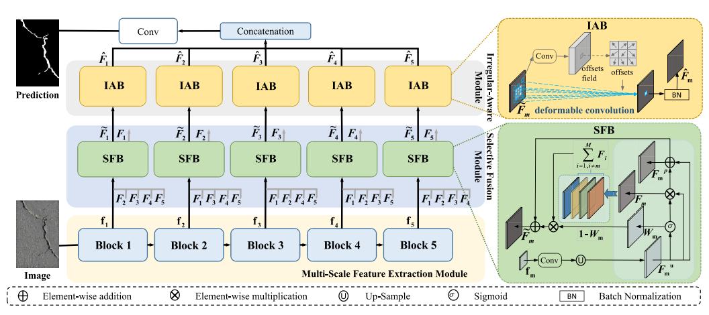

# Selective Feature Fusion and Irregular-Aware Network for Pavement Crack Detection

# 👀Introduction

This repository contains the code for our paper `Selective Feature Fusion and Irregular-Aware Network for Pavement Crack Detection`. [[Paper](https://ieeexplore.ieee.org/document/10299612)]



# 💡Requirements

## Environment requirements: 

- CUDA 11.7

- Python 3.8

## Dependency requirements: 

- numpy 1.20.0
- torch  1.13.1
- torchaudio 2.0.2
- torchvision 0.14.1

# 📦Usage

## Training

You can modify the training parameters in the **train_SFIAN.sh** file and run it with the following command:

``````
bash ./scripts/train_SFIAN.sh 
``````

## Testing

You can modify the test parameters in the **test_SFIAN.sh** file and run it with the following command:

``````
bash ./scripts/test_SFIAN.sh 
``````

## Evaluation

Calculate ODS, OIS, P, R, F1, mIoU metrics:

``````
cd eval
python evaluate.py
``````

Calculate params、FLOPs metrics:

``````
cd eval
python flops.py
``````

# 📌BibTeX & Citation

If you find this code useful, please consider citing our work:

``````
@article{cheng2023selective,
  title={Selective feature fusion and irregular-aware network for pavement crack detection},
  author={Cheng, Xu and He, Tian and Shi, Fan and Zhao, Meng and Liu, Xiufeng and Chen, Shengyong},
  journal={IEEE Transactions on Intelligent Transportation Systems},
  year={2023},
  publisher={IEEE}
}
``````

```
@article{liu2024staircase,
  title={Staircase Cascaded Fusion of Lightweight Local Pattern Recognition and Long-Range Dependencies for Structural Crack Segmentation},
  author={Liu, Hui and Jia, Chen and Shi, Fan and Cheng, Xu and Wang, Mianzhao and Chen, Shengyong},
  journal={arXiv preprint arXiv:2408.12815},
  year={2024}
}
```

